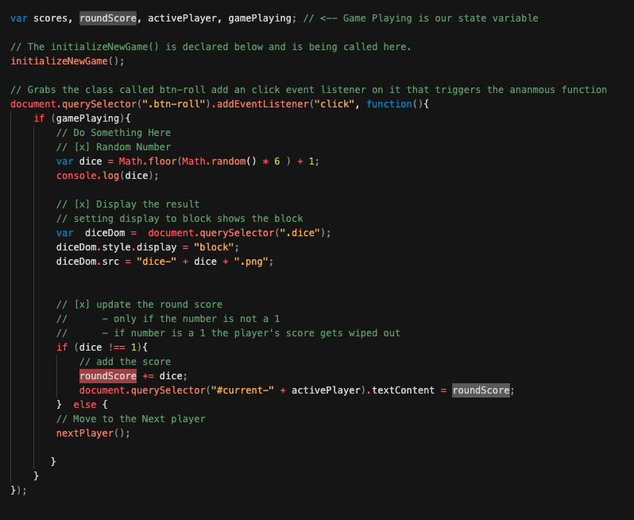

# Sabatical Projects - JavaScript Project 1: Pig Game

This repo holds the finished product of the Javascript project I built while taking Jonas Schmedtmann's [Complete Javascript Course](https://github.com/rightbrainpapi/complete-javascript-course)  

To view the project click here: [Pig Game](https://rightbrainpapi.github.io/1-Pig-Game/)

👇 **_Please read the following Frequently Asked Questions (FAQ) carefully before starting the course_** 👇

## 3 Things I learned

Below are the top three fundamental things I learned while building this project.
### Hoisting and Function Declarations:

#### Example from the code

- [Hoisting and Functional Declaration](readmeAssets/hoistingandfunctiondeclaration.png)

### Scope Chain: Lexical Scope 
**Scoping answers the question _where_ can we access a variable or a function.**

In JavaScript each function creates a scope (aka space/environment). Variables that are defined in a scope are only made accessible within the parameters of that scope. 

#### Lexical Scope
JavaScript uses Lexical Scoping.
When a programmer created a JavaScript function the programmer effectively creates a new lexical scope.

Consider the following example.
Let's say a programmer does the following:
- creates a function named functionA
- adds variables to functionA 
- adds a nested function named functionB inside of functionA.
- adds variables to functionB

If this were the case functionB would have access to all of the variables defined in functionA and the global scope. But, neither functionA nor the global scope would have access to variables in functionB.

**_Note: One can think of it like a parent child relationship. The child recieves genes from the parent--not the other way around._**

This is lexical scoping!

#### Example from the code
- 

### State Variables

#### Example from the code

**A:** If you're new to GitHub and just want to download the complete package, hit the green button saying "Clone or download", choose the "Download ZIP" option, and you're good to go.

### Q2: I'm stuck in one of the projects. Where do I get help?++=