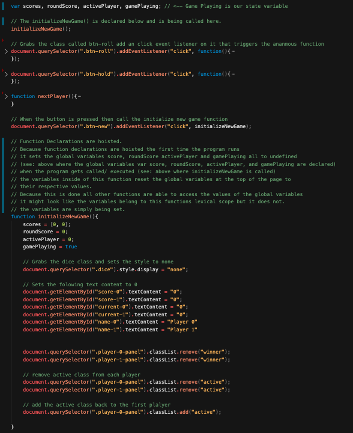
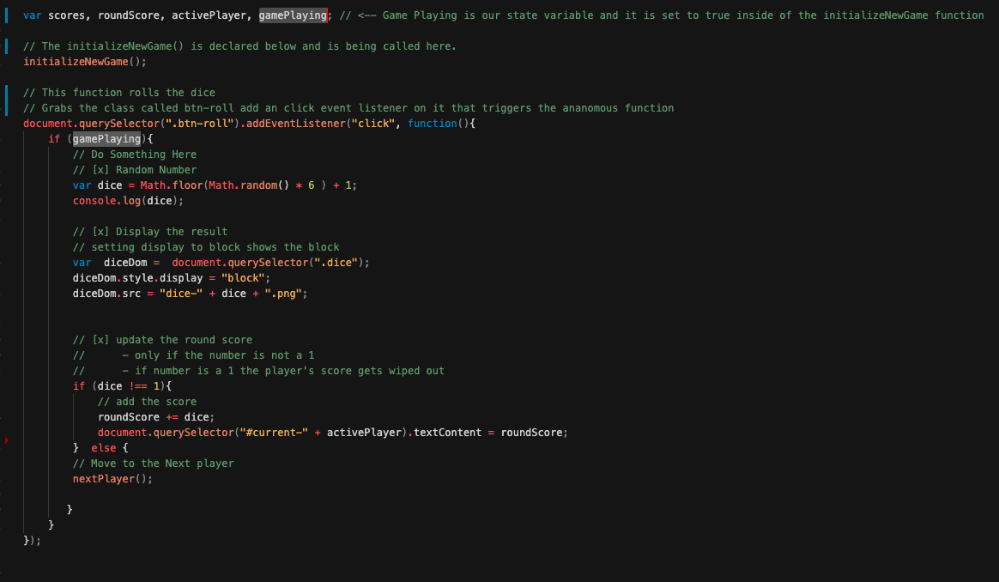
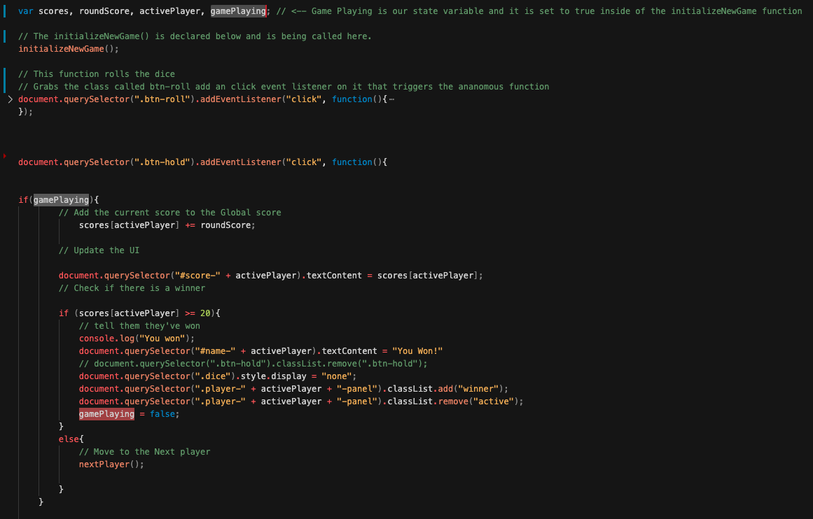

# Sabatical Projects - JavaScript Project 1: Pig Game

This repo holds the finished product of the Javascript project I built while taking Jonas Schmedtmann's [Complete Javascript Course](https://github.com/rightbrainpapi/complete-javascript-course)  

To view the project click here: [Pig Game](https://rightbrainpapi.github.io/1-Pig-Game/)

## 3 Things I learned

Below are the top three fundamental things I learned while building this project.

---

### 1. Hoisting and Function Declarations:
**Hoisting is the _process_ where variables and functions are moved to the top of their scopes before execution.**

In JavaScript, this means that regardless of where variables or functions are declared they will always be moved to the top of their scope. This is applicable to locally and globally declared variables and functions.

#### Example from the code

#### Function Declaration and Scope

In the above example we see:
1. Variables are declared at the very top of the page. 
2. A function named `initializeNewGame()` being called
3. the function named initializeNewGame being declaed (toward the buttom)

Because of hoisting the computer knows what `initializeNewGame()` means even though the declaration of the function is made later on in the script.

Additionally, upon execution of the hoisted `initializeNewGame()` function the global variables that are declared outside of the function but set/initialized inside of `initializeNewGame()` are made available to all other functions that exist in the global scope.  

**_Note: JavaScript only hoists declarations, not the initialisations. So in this above example that initializations of the  global variables only happened after the hoisted function was execiuted/called._**

---

### 2. Scope Chain: Lexical Scope 
**Scoping answers the question _where_ can we access a variable or a function.**

In JavaScript each function creates a scope (aka space/environment). Variables that are defined in a scope are only made accessible within the parameters of that scope. 

#### Example from the code

#### Lexical Scope
JavaScript uses Lexical Scoping.
When a programmer created a JavaScript function the programmer effectively creates a new lexical scope.

Consider the following example.
Let's say a programmer does the following:
- creates a function named functionA
- adds variables to functionA 
- adds a nested function named functionB inside of functionA.
- adds variables to functionB

If this were the case functionB would have access to all of the variables defined in functionA and the global scope. But, neither functionA nor the global scope would have access to variables in functionB.

**_Note: One can think of it like a parent child relationship. The child recieves genes from the parent--not the other way around._**

This is lexical scoping!

--- 

### 3. State Variables
**State variable tells us the condition of a system.**

In JavaScript, and in programming i general,  we use (and need) a state variable when we need to remember the state or condition of something. 

#### Example from the code

#### State Variable Pt.1 
In the above example we:
-  used a state variable called gamePlaying which is set to true in the initializeNewGame function.
-  passed the gamePlaying state variable in as a condition inside ananomous function that rolls the dice on click
    - Because gameplaying is true it allows the player to in fact roll the dice.

#### State Variable Pt.2 

In the above example we:
-  used a state variable called gamePlaying which is set to true in the initializeNewGame function.
-  set the gamePlaying variable to false inside of the if statement in the event that a player has made has a score of a winning score.
    - The next time gamePlaying state variable goes into the if condition of the roll dice ananomous function it will be false. 
        - Because gameplaying is false it prevents the player from rolling the dice
